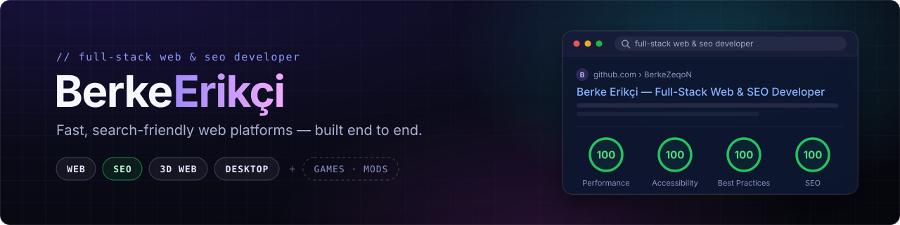

<a href="./README.md">🇬🇧 English</a> &nbsp;·&nbsp; <a href="./README.tr.md">🇹🇷 Türkçe</a>

 

---

### ⚡ About

CS student and freelance developer. I design and ship software end to end — web platforms, 3D web experiences, desktop apps, and games.

- 🌐 **Web** — Next.js, React Three Fiber, Node / Fastify, Flutter
- 🎮 **Games** — Roblox tycoons in Lua, Minecraft Forge modpacks
- 🖥️ **Desktop** — Java / Spring Boot + JavaFX, C# / WPF
- 🔭 **Currently** — a multi-restaurant ordering platform and a CLI agent orchestrator
- 🌱 **Goal** — building toward Teknofest / TÜBİTAK projects

---

### 🛠️ Stack

---

📫 **berke.codehub@gmail.com**

